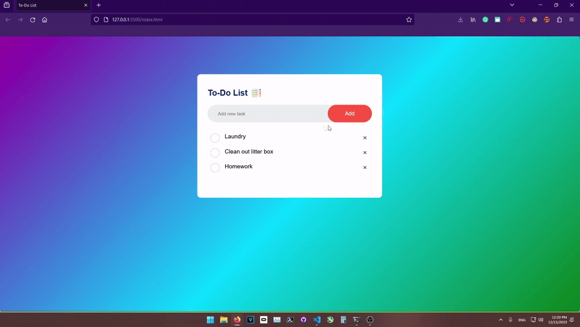
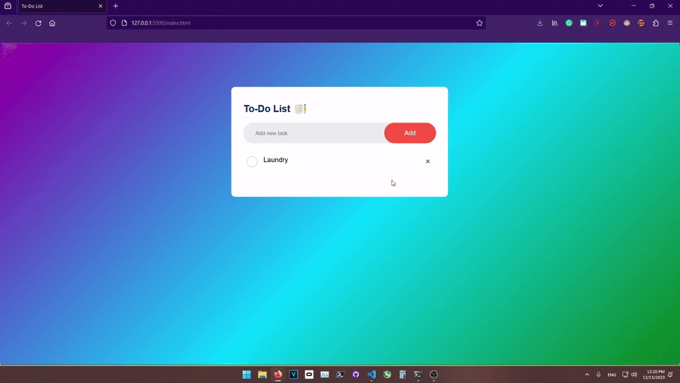

# To-Do List

A basic To-Do List web application built with HTML, CSS, and JavaScript!

## Use

To open the list, open the index.html file in your preferred browser.
Once opened, you can add a task by typing its name into the text box, then either clicking the "Add" button or press Enter.
Note: you will not be able to add a task to the list unless you have provided a task name.

Once you've added the tasks you want to the list, you can then mark them as completed by clicking on the task.

When you want to clear items off of your list, you can click the "X" on the right of a task to remove it.

The list also retains your list information using localStorage! You can test this by making a list, and refreshing your browser or closing it and reopening the index.html file.

